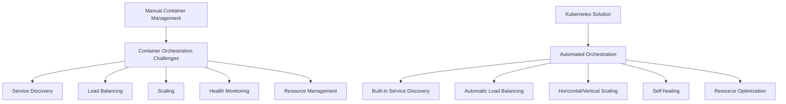
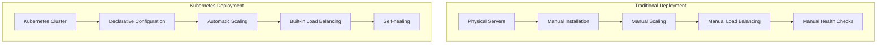
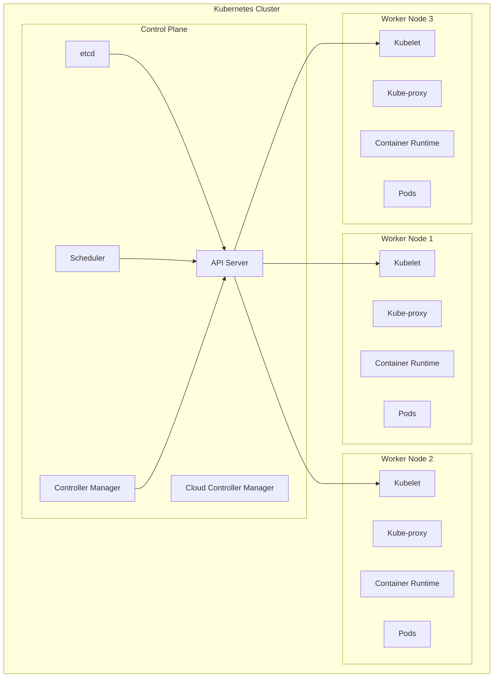
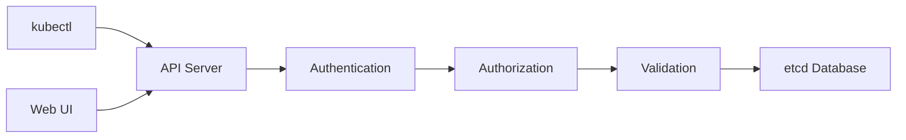
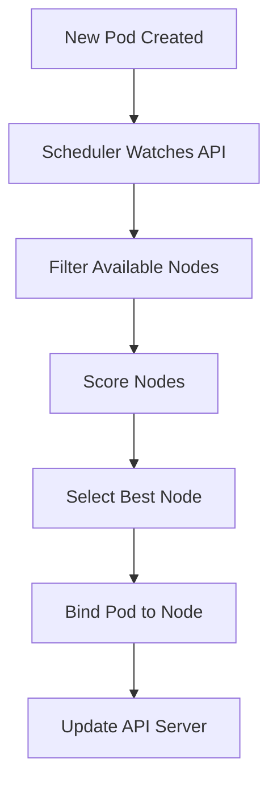
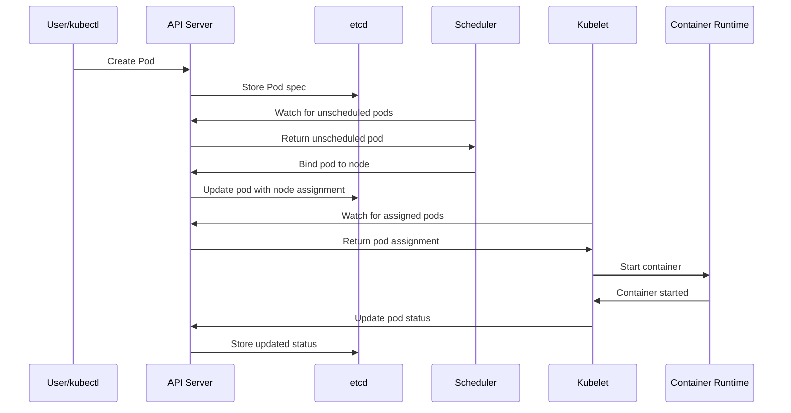
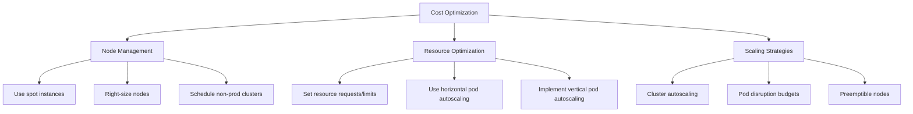
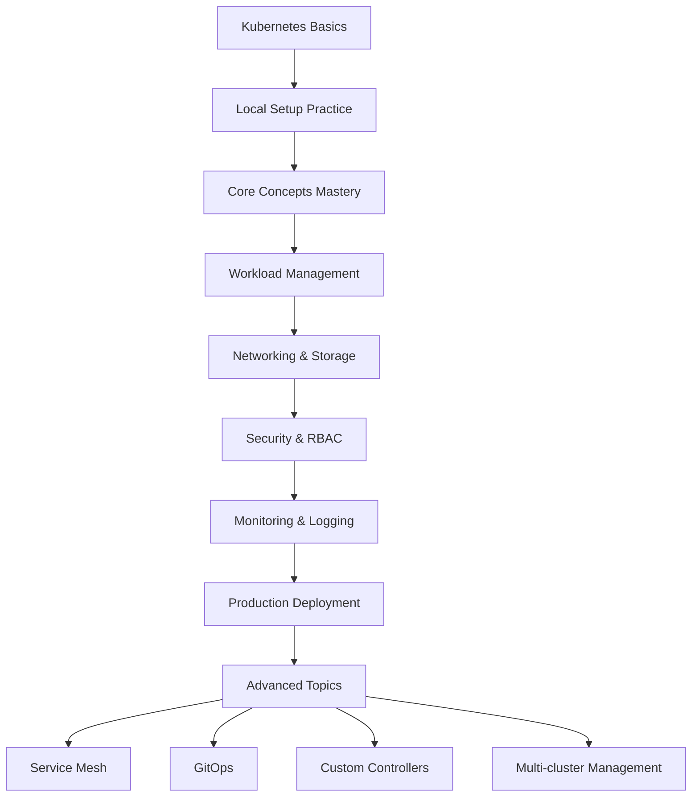

# Kubernetes Comprehensive Learning Guide

## Table of Contents
1. [Why Kubernetes?](#why-kubernetes)
2. [Kubernetes Basics](#kubernetes-basics)
3. [Kubernetes Architecture](#kubernetes-architecture)
4. [Kubernetes Components](#kubernetes-components)
5. [Local Installation with Minikube](#local-installation-with-minikube)
6. [Local Installation with Kind](#local-installation-with-kind)
7. [Cloud Installation](#cloud-installation)
8. [Practical Examples](#practical-examples)
9. [Best Practices](#best-practices)
10. [Resources and Next Steps](#resources-and-next-steps)

---

## Why Kubernetes?

### The Container Challenge

Before diving into Kubernetes, let's understand why it exists. Modern applications are increasingly built using containers, but managing containers at scale presents several challenges:

#### Problems with Manual Container Management:
- **Scaling Issues**: Manually starting/stopping containers based on demand
- **Service Discovery**: How do containers find and communicate with each other?
- **Load Balancing**: Distributing traffic across multiple container instances
- **Health Monitoring**: Detecting when containers fail and replacing them
- **Resource Management**: Efficiently utilizing CPU, memory, and storage
- **Configuration Management**: Managing secrets, config files, and environment variables
- **Rolling Updates**: Deploying new versions without downtime

### What Kubernetes Solves



### Key Benefits of Kubernetes:

| Benefit | Description | Business Impact |
|---------|-------------|-----------------|
| **Automated Deployment** | Deploy applications with simple commands | Faster time-to-market |
| **Self-Healing** | Automatically restart failed containers | Improved reliability |
| **Auto-Scaling** | Scale applications based on demand | Cost optimization |
| **Service Discovery** | Automatic networking between services | Simplified architecture |
| **Rolling Updates** | Deploy without downtime | Better user experience |
| **Resource Optimization** | Efficient use of infrastructure | Lower operational costs |
| **Portability** | Run anywhere (cloud, on-premise, hybrid) | Vendor independence |

---

## Kubernetes Basics

### What is Kubernetes?

Kubernetes (often abbreviated as "K8s") is an open-source container orchestration platform that automates the deployment, scaling, and management of containerized applications.

### Key Concepts

#### 1. **Cluster**
A set of machines (physical or virtual) that run Kubernetes. A cluster consists of:
- **Control Plane**: Manages the cluster
- **Worker Nodes**: Run your applications

#### 2. **Pod**
- The smallest deployable unit in Kubernetes
- Contains one or more containers
- Containers in a pod share storage and network
- Pods are ephemeral (temporary)

#### 3. **Node**
- A physical or virtual machine in the cluster
- Can be a control plane node or worker node
- Runs pods and Kubernetes components

#### 4. **Service**
- Provides stable networking for pods
- Acts as a load balancer
- Enables service discovery

#### 5. **Deployment**
- Manages pod replicas
- Handles rolling updates
- Ensures desired state

### Kubernetes vs. Traditional Deployment



---

## Kubernetes Architecture

Kubernetes follows a distributed architecture pattern with clear separation between the control plane and data plane.

### High-Level Architecture



### Control Plane vs Data Plane

| Component | Control Plane | Data Plane |
|-----------|--------------|------------|
| **Purpose** | Cluster management and orchestration | Run application workloads |
| **Components** | API Server, etcd, Scheduler, Controller Manager | Kubelet, Kube-proxy, Container Runtime |
| **Responsibilities** | - Make global decisions<br>- Store cluster state<br>- Schedule pods<br>- Manage controllers | - Run pods<br>- Maintain network rules<br>- Report node status<br>- Execute workloads |
| **Scaling** | Usually 3-5 nodes for HA | Can scale to thousands of nodes |
| **Failure Impact** | Cannot create/update resources | Workloads continue running |

---

## Kubernetes Components

### Control Plane Components

#### 1. **API Server (kube-apiserver)**
- **Purpose**: The front-end of the Kubernetes control plane
- **Functions**:
  - Exposes the Kubernetes API
  - Handles authentication and authorization
  - Validates and processes API requests
  - Serves as the communication hub for all components



#### 2. **etcd**
- **Purpose**: Distributed key-value store for cluster data
- **Stores**:
  - Cluster configuration
  - Pod states and metadata
  - Secrets and ConfigMaps
  - Network policies
- **Features**:
  - High availability
  - Consistent data storage
  - Backup and restore capabilities

#### 3. **Scheduler (kube-scheduler)**
- **Purpose**: Assigns pods to nodes
- **Decision Factors**:
  - Resource requirements (CPU, memory)
  - Node capacity and availability
  - Affinity and anti-affinity rules
  - Quality of Service requirements
  - Custom scheduling policies



#### 4. **Controller Manager (kube-controller-manager)**
- **Purpose**: Runs controller processes that regulate cluster state
- **Key Controllers**:
  - **Node Controller**: Monitors node health
  - **Deployment Controller**: Manages deployments
  - **Service Controller**: Manages services
  - **Endpoint Controller**: Manages endpoints
  - **ReplicaSet Controller**: Ensures desired pod replicas

#### 5. **Cloud Controller Manager**
- **Purpose**: Integrates with cloud provider APIs
- **Functions**:
  - Node management (create/delete cloud VMs)
  - Load balancer management
  - Volume management
  - Route management

### Worker Node Components

#### 1. **Kubelet**
- **Purpose**: Node agent that communicates with control plane
- **Responsibilities**:
  - Register node with cluster
  - Watch for pod assignments
  - Start and stop containers
  - Report node and pod status
  - Execute health checks

#### 2. **Kube-proxy**
- **Purpose**: Network proxy that maintains network rules
- **Functions**:
  - Implement service networking
  - Load balance traffic to pods
  - Maintain iptables rules
  - Enable service discovery

#### 3. **Container Runtime**
- **Purpose**: Software responsible for running containers
- **Options**:
  - **containerd**: Most popular, lightweight
  - **CRI-O**: Kubernetes-native runtime
  - **Docker Engine**: Traditional but being phased out

### Component Communication Flow



---

## Local Installation with Minikube

Minikube is the most popular tool for running Kubernetes locally. It implements a local Kubernetes cluster on macOS, Linux, and Windows, with primary goals to be the best tool for local Kubernetes application development and to support all Kubernetes features that fit.

### System Requirements

| Component | Minimum | Recommended |
|-----------|---------|-------------|
| **CPU** | 2 cores | 4+ cores |
| **Memory** | 2GB RAM | 4GB+ RAM |
| **Disk Space** | 20GB | 40GB+ |
| **Virtualization** | Enabled | Enabled |

### Installation

#### Linux Installation
```bash
# Download latest minikube
curl -LO https://github.com/kubernetes/minikube/releases/latest/download/minikube-linux-amd64

# Install minikube
sudo install minikube-linux-amd64 /usr/local/bin/minikube && rm minikube-linux-amd64

# Verify installation
minikube version
```

#### macOS Installation
```bash
# Using Homebrew
brew install minikube

# Or direct download
curl -LO https://github.com/kubernetes/minikube/releases/latest/download/minikube-darwin-amd64
sudo install minikube-darwin-amd64 /usr/local/bin/minikube
```

#### Windows Installation
```powershell
# Using Chocolatey
choco install minikube

# Or download from GitHub and add to PATH
```

### Install kubectl

```bash
# Linux
curl -LO "https://dl.k8s.io/release/$(curl -L -s https://dl.k8s.io/release/stable.txt)/bin/linux/amd64/kubectl"
chmod +x kubectl
sudo mv kubectl /usr/local/bin/

# macOS
brew install kubectl

# Windows
choco install kubernetes-cli
```

### Starting Your First Cluster

```bash
# Start minikube with default settings
minikube start

# Start with specific resources
minikube start --cpus=4 --memory=8192mb --disk-size=50gb

# Start with specific Kubernetes version
minikube start --kubernetes-version=v1.32.0

# Start with specific driver
minikube start --driver=docker
```

### Available Drivers

| Driver | Platform | Pros | Cons |
|--------|----------|------|------|
| **Docker** | All | Fast, widely available | Requires Docker |
| **VirtualBox** | All | Full isolation | Slower performance |
| **KVM2** | Linux | Good performance | Linux only |
| **HyperKit** | macOS | Native integration | macOS only |
| **Hyper-V** | Windows | Native integration | Windows Pro+ only |

### Minikube Commands Cheat Sheet

```bash
# Cluster Management
minikube start                    # Start cluster
minikube stop                     # Stop cluster
minikube delete                   # Delete cluster
minikube status                   # Check cluster status
minikube pause                    # Pause cluster
minikube unpause                  # Unpause cluster

# Information
minikube ip                       # Get cluster IP
minikube dashboard                # Open Kubernetes dashboard
minikube service <service-name>   # Access service URL

# Add-ons
minikube addons list              # List available add-ons
minikube addons enable ingress    # Enable ingress
minikube addons enable dashboard  # Enable dashboard

# Advanced
minikube ssh                      # SSH into minikube node
minikube logs                     # View minikube logs
minikube tunnel                   # Create tunnel for LoadBalancer services
```

### Useful Minikube Add-ons

```bash
# Enable essential add-ons
minikube addons enable dashboard
minikube addons enable ingress
minikube addons enable metrics-server
minikube addons enable storage-provisioner

# View all available add-ons
minikube addons list
```

---

## Local Installation with Kind

Kind (Kubernetes in Docker) is a tool for running local Kubernetes clusters using Docker container "nodes". Kind was primarily designed for testing Kubernetes itself, but may be used for local development or CI.

### Why Choose Kind?

| Feature | Kind | Minikube |
|---------|------|----------|
| **Multi-node support** | ✅ Easy | ⚠️ Complex |
| **CI/CD friendly** | ✅ Excellent | ⚠️ Good |
| **Resource usage** | ✅ Lower | ⚠️ Higher |
| **Setup complexity** | ✅ Simple | ✅ Simple |
| **Add-ons** | ⚠️ Manual | ✅ Built-in |
| **LoadBalancer support** | ⚠️ Manual | ✅ Built-in |

### Installation

#### Prerequisites
```bash
# Install Docker first
# Ubuntu/Debian
sudo apt update && sudo apt install docker.io

# macOS
brew install docker

# Start Docker service
sudo systemctl start docker
sudo usermod -aG docker $USER  # Add user to docker group
```

#### Install Kind
```bash
# Linux/macOS
curl -Lo ./kind https://kind.sigs.k8s.io/dl/v0.29.0/kind-linux-amd64
chmod +x ./kind
sudo mv ./kind /usr/local/bin/kind

# macOS with Homebrew
brew install kind

# Using Go
go install sigs.k8s.io/kind@v0.29.0
```

### Creating Clusters

#### Single Node Cluster
```bash
# Create a simple cluster
kind create cluster

# Create cluster with custom name
kind create cluster --name my-cluster

# Verify cluster
kubectl cluster-info --context kind-kind
```

#### Multi-Node Cluster
```yaml
# cluster-config.yaml
kind: Cluster
apiVersion: kind.x-k8s.io/v1alpha4
nodes:
- role: control-plane
- role: worker
- role: worker
- role: worker
```

```bash
# Create multi-node cluster
kind create cluster --config cluster-config.yaml --name multi-node

# View nodes
kubectl get nodes
```

#### Advanced Configuration
```yaml
# advanced-config.yaml
kind: Cluster
apiVersion: kind.x-k8s.io/v1alpha4
name: advanced-cluster
nodes:
- role: control-plane
  kubeadmConfigPatches:
  - |
    kind: InitConfiguration
    nodeRegistration:
      kubeletExtraArgs:
        node-labels: "ingress-ready=true"
  extraPortMappings:
  - containerPort: 80
    hostPort: 80
    protocol: TCP
  - containerPort: 443
    hostPort: 443
    protocol: TCP
- role: worker
  extraMounts:
  - hostPath: /path/to/my/files
    containerPath: /files
- role: worker
```

### Kind Commands

```bash
# Cluster Management
kind create cluster --name <name>     # Create cluster
kind delete cluster --name <name>     # Delete cluster
kind get clusters                     # List clusters

# Working with Images
kind load docker-image <image>        # Load Docker image into cluster
kind load docker-image nginx:latest --name my-cluster

# Export cluster logs
kind export logs ./logs --name my-cluster
```

### Setting up Ingress with Kind

```bash
# 1. Create cluster with port mapping
cat <<EOF | kind create cluster --config=-
kind: Cluster
apiVersion: kind.x-k8s.io/v1alpha4
nodes:
- role: control-plane
  kubeadmConfigPatches:
  - |
    kind: InitConfiguration
    nodeRegistration:
      kubeletExtraArgs:
        node-labels: "ingress-ready=true"
  extraPortMappings:
  - containerPort: 80
    hostPort: 80
  - containerPort: 443
    hostPort: 443
EOF

# 2. Install ingress controller
kubectl apply -f https://raw.githubusercontent.com/kubernetes/ingress-nginx/main/deploy/static/provider/kind/deploy.yaml

# 3. Wait for ingress controller
kubectl wait --namespace ingress-nginx \
  --for=condition=ready pod \
  --selector=app.kubernetes.io/component=controller \
  --timeout=90s
```

---

## Cloud Installation

Cloud providers offer managed Kubernetes services that handle the control plane for you. The three main contenders are Amazon Web Services (AWS) with EKS, Microsoft Azure with AKS, and Google Cloud with GKE.

### Comparison of Cloud Providers

| Feature | AWS EKS | Azure AKS | Google GKE |
|---------|---------|-----------|------------|
| **Control Plane Cost** | $0.20/hour | Free | $0.10/hour |
| **Maximum Nodes** | 450 | 1000 | 5000 |
| **Auto-scaling** | ✅ | ✅ | ✅ |
| **Upgrade Management** | Manual | Manual | Automatic |
| **Monitoring** | CloudWatch | Azure Monitor | Stackdriver |
| **Service Mesh** | Manual setup | Manual setup | Istio built-in |
| **Windows Support** | ✅ | ✅ | ❌ |

### Amazon EKS (Elastic Kubernetes Service)

#### Prerequisites
```bash
# Install AWS CLI
curl "https://awscli.amazonaws.com/awscli-exe-linux-x86_64.zip" -o "awscliv2.zip"
unzip awscliv2.zip
sudo ./aws/install

# Configure AWS credentials
aws configure

# Install eksctl
curl --silent --location "https://github.com/weaveworks/eksctl/releases/latest/download/eksctl_$(uname -s)_amd64.tar.gz" | tar xz -C /tmp
sudo mv /tmp/eksctl /usr/local/bin
```

#### Create EKS Cluster
```bash
# Simple cluster creation
eksctl create cluster --name my-cluster --region us-west-2

# Advanced cluster with specific configuration
eksctl create cluster \
  --name production-cluster \
  --version 1.32 \
  --region us-west-2 \
  --nodegroup-name workers \
  --node-type m5.large \
  --nodes 3 \
  --nodes-min 1 \
  --nodes-max 10 \
  --managed
```

#### EKS Configuration YAML
```yaml
# cluster.yaml
apiVersion: eksctl.io/v1alpha5
kind: ClusterConfig

metadata:
  name: production-cluster
  region: us-west-2
  version: "1.32"

managedNodeGroups:
  - name: worker-nodes
    instanceType: m5.large
    minSize: 1
    maxSize: 10
    desiredCapacity: 3
    volumeSize: 100
    ssh:
      allow: true
    iam:
      withAddonPolicies:
        autoScaler: true
        cloudWatch: true
        ebs: true
```

```bash
# Create cluster from config
eksctl create cluster -f cluster.yaml
```

### Azure AKS (Azure Kubernetes Service)

#### Prerequisites
```bash
# Install Azure CLI
curl -sL https://aka.ms/InstallAzureCLIDeb | sudo bash

# Login to Azure
az login

# Create resource group
az group create --name myResourceGroup --location eastus
```

#### Create AKS Cluster
```bash
# Simple cluster creation
az aks create \
  --resource-group myResourceGroup \
  --name myAKSCluster \
  --node-count 3 \
  --enable-addons monitoring \
  --generate-ssh-keys

# Get credentials
az aks get-credentials --resource-group myResourceGroup --name myAKSCluster

# Advanced cluster with specific features
az aks create \
  --resource-group myResourceGroup \
  --name production-cluster \
  --node-count 3 \
  --node-vm-size Standard_D4s_v3 \
  --kubernetes-version 1.32.0 \
  --enable-addons monitoring,http_application_routing \
  --enable-autoscaler \
  --min-count 1 \
  --max-count 10 \
  --network-plugin azure \
  --service-cidr 10.0.0.0/16 \
  --dns-service-ip 10.0.0.10
```

### Google GKE (Google Kubernetes Engine)

#### Prerequisites
```bash
# Install Google Cloud SDK
curl https://sdk.cloud.google.com | bash
exec -l $SHELL

# Initialize gcloud
gcloud init

# Set default project and zone
gcloud config set project PROJECT_ID
gcloud config set compute/zone us-central1-a

# Enable required APIs
gcloud services enable container.googleapis.com
```

#### Create GKE Cluster
```bash
# Simple cluster creation
gcloud container clusters create my-cluster \
  --num-nodes=3 \
  --zone=us-central1-a

# Get credentials
gcloud container clusters get-credentials my-cluster --zone=us-central1-a

# Advanced cluster with auto-scaling and specific machine types
gcloud container clusters create production-cluster \
  --machine-type=e2-standard-4 \
  --num-nodes=3 \
  --enable-autoscaling \
  --min-nodes=1 \
  --max-nodes=10 \
  --enable-autorepair \
  --enable-autoupgrade \
  --disk-size=100GB \
  --image-type=COS_CONTAINERD \
  --cluster-version=1.32 \
  --zone=us-central1-a
```

### Cost Optimization Tips



#### Cost Comparison Table

| Provider | Control Plane | Worker Nodes | Additional Costs |
|----------|---------------|--------------|------------------|
| **AWS EKS** | $73/month | EC2 pricing | Data transfer, LoadBalancer |
| **Azure AKS** | Free | VM pricing | Data transfer, LoadBalancer |
| **Google GKE** | $36/month | Compute pricing | Data transfer, sustained use discounts |

---

## Practical Examples

### Example 1: Deploying a Simple Web Application

```yaml
# nginx-deployment.yaml
apiVersion: apps/v1
kind: Deployment
metadata:
  name: nginx-deployment
  labels:
    app: nginx
spec:
  replicas: 3
  selector:
    matchLabels:
      app: nginx
  template:
    metadata:
      labels:
        app: nginx
    spec:
      containers:
      - name: nginx
        image: nginx:1.24
        ports:
        - containerPort: 80
        resources:
          requests:
            memory: "64Mi"
            cpu: "250m"
          limits:
            memory: "128Mi"
            cpu: "500m"
---
apiVersion: v1
kind: Service
metadata:
  name: nginx-service
spec:
  selector:
    app: nginx
  ports:
    - protocol: TCP
      port: 80
      targetPort: 80
  type: ClusterIP
```

```bash
# Deploy the application
kubectl apply -f nginx-deployment.yaml

# Check deployment status
kubectl get deployments
kubectl get pods
kubectl get services

# Scale the deployment
kubectl scale deployment nginx-deployment --replicas=5

# View deployment details
kubectl describe deployment nginx-deployment
```

### Example 2: ConfigMap and Secret Usage

```yaml
# app-config.yaml
apiVersion: v1
kind: ConfigMap
metadata:
  name: app-config
data:
  database_url: "postgresql://localhost:5432/myapp"
  debug_mode: "true"
  app_name: "My Application"
---
apiVersion: v1
kind: Secret
metadata:
  name: app-secrets
type: Opaque
data:
  database_password: cGFzc3dvcmQxMjM=  # base64 encoded "password123"
  api_key: YWJjZGVmZ2hpams=  # base64 encoded "abcdefghijk"
---
apiVersion: apps/v1
kind: Deployment
metadata:
  name: web-app
spec:
  replicas: 2
  selector:
    matchLabels:
      app: web-app
  template:
    metadata:
      labels:
        app: web-app
    spec:
      containers:
      - name: web-app
        image: nginx:alpine
        env:
        - name: DATABASE_URL
          valueFrom:
            configMapKeyRef:
              name: app-config
              key: database_url
        - name: DEBUG_MODE
          valueFrom:
            configMapKeyRef:
              name: app-config
              key: debug_mode
        - name: DATABASE_PASSWORD
          valueFrom:
            secretKeyRef:
              name: app-secrets
              key: database_password
        - name: API_KEY
          valueFrom:
            secretKeyRef:
              name: app-secrets
              key: api_key
```

### Example 3: Persistent Storage

```yaml
# persistent-storage.yaml
apiVersion: v1
kind: PersistentVolumeClaim
metadata:
  name: web-app-storage
spec:
  accessModes:
    - ReadWriteOnce
  resources:
    requests:
      storage: 10Gi
  storageClassName: standard
---
apiVersion: apps/v1
kind: Deployment
metadata:
  name: web-app-with-storage
spec:
  replicas: 1
  selector:
    matchLabels:
      app: web-app-with-storage
  template:
    metadata:
      labels:
        app: web-app-with-storage
    spec:
      containers:
      - name: web-app
        image: nginx:alpine
        volumeMounts:
        - name: web-storage
          mountPath: /usr/share/nginx/html
        ports:
        - containerPort: 80
      volumes:
      - name: web-storage
        persistentVolumeClaim:
          claimName: web-app-storage
```

### Example 4: Ingress Configuration

```yaml
# ingress-example.yaml
apiVersion: networking.k8s.io/v1
kind: Ingress
metadata:
  name: web-app-ingress
  annotations:
    nginx.ingress.kubernetes.io/rewrite-target: /
    nginx.ingress.kubernetes.io/ssl-redirect: "true"
spec:
  ingressClassName: nginx
  tls:
  - hosts:
    - myapp.example.com
    secretName: tls-secret
  rules:
  - host: myapp.example.com
    http:
      paths:
      - path: /
        pathType: Prefix
        backend:
          service:
            name: nginx-service
            port:
              number: 80
      - path: /api
        pathType: Prefix
        backend:
          service:
            name: api-service
            port:
              number: 8080
```

---

## Best Practices

### 1. Resource Management

```yaml
# Always set resource requests and limits
resources:
  requests:
    memory: "64Mi"
    cpu: "250m"
  limits:
    memory: "128Mi"
    cpu: "500m"
```

### 2. Health Checks

```yaml
# Implement liveness and readiness probes
livenessProbe:
  httpGet:
    path: /health
    port: 8080
  initialDelaySeconds: 30
  periodSeconds: 10
  timeoutSeconds: 5
  failureThreshold: 3

readinessProbe:
  httpGet:
    path: /ready
    port: 8080
  initialDelaySeconds: 5
  periodSeconds: 5
  timeoutSeconds: 3
  failureThreshold: 3
```

### 3. Security Best Practices

```yaml
# Use security contexts
securityContext:
  runAsNonRoot: true
  runAsUser: 1000
  fsGroup: 2000
  capabilities:
    drop:
    - ALL
  readOnlyRootFilesystem: true
  allowPrivilegeEscalation: false
```

### 4. Namespace Organization

```bash
# Create namespaces for different environments
kubectl create namespace development
kubectl create namespace staging
kubectl create namespace production

# Use namespace in deployments
kubectl apply -f app.yaml -n development
```

### 5. Monitoring and Logging

```yaml
# Add labels for monitoring
metadata:
  labels:
    app: my-app
    version: v1.0.0
    environment: production
    team: backend
```

---

## Resources and Next Steps

### Essential kubectl Commands

```bash
# Cluster Information
kubectl cluster-info
kubectl get nodes
kubectl describe node <node-name>

# Working with Pods
kubectl get pods
kubectl describe pod <pod-name>
kubectl logs <pod-name>
kubectl exec -it <pod-name> -- /bin/bash

# Working with Deployments
kubectl get deployments
kubectl scale deployment <deployment-name> --replicas=5
kubectl rollout status deployment/<deployment-name>
kubectl rollout history deployment/<deployment-name>

# Working with Services
kubectl get services
kubectl port-forward service/<service-name> 8080:80

# Configuration
kubectl apply -f <file.yaml>
kubectl delete -f <file.yaml>
kubectl get all
kubectl get all -n <namespace>
```

### Learning Path



### Recommended Tools

| Category | Tools | Purpose |
|----------|-------|---------|
| **Development** | kubectl, k9s, kubectx | Cluster interaction |
| **Package Management** | Helm, Kustomize | Application deployment |
| **Monitoring** | Prometheus, Grafana | Metrics and alerting |
| **Logging** | ELK Stack, Fluentd | Log aggregation |
| **Security** | Falco, OPA Gatekeeper | Security monitoring |
| **CI/CD** | Tekton, ArgoCD | Pipeline automation |

### Next Steps

1. **Hands-on Practice**: Set up a local cluster and deploy sample applications
2. **Certification**: Consider CKA (Certified Kubernetes Administrator) or CKAD (Certified Kubernetes Application Developer)
3. **Advanced Topics**: Learn about service mesh, operators, and custom resources
4. **Production Readiness**: Study monitoring, logging, security, and backup strategies
5. **Community**: Join Kubernetes community, attend meetups, contribute to open source

### Useful Resources

- **Official Documentation**: https://kubernetes.io/docs/
- **Interactive Tutorials**: https://kubernetes.io/docs/tutorials/
- **Kubernetes by Example**: https://kubernetesbyexample.com/
- **CNCF Landscape**: https://landscape.cncf.io/
- **Kubernetes Slack**: https://kubernetes.slack.com/

---

## Troubleshooting Common Issues

### Pod Issues

```bash
# Pod stuck in Pending state
kubectl describe pod <pod-name>
# Look for events: insufficient resources, scheduling issues

# Pod CrashLoopBackOff
kubectl logs <pod-name>
kubectl logs <pod-name> --previous
# Check container logs and exit codes

# ImagePullBackOff
kubectl describe pod <pod-name>
# Check image name, registry access, credentials
```

### Network Issues

```bash
# Service not accessible
kubectl get endpoints <service-name>
kubectl describe service <service-name>

# DNS resolution issues
kubectl run test-pod --image=busybox -it --rm -- nslookup <service-name>
```

### Resource Issues

```bash
# Check resource usage
kubectl top nodes
kubectl top pods

# Check resource quotas
kubectl describe resourcequota -n <namespace>
```

This comprehensive guide provides a solid foundation for understanding and working with Kubernetes. Start with local installations, practice with the examples, and gradually move to cloud deployments as you gain confidence.
