# Kubernetes Components: In-Depth Learning Guide

## 🎯 **Executive Summary**

This comprehensive guide covers the essential Kubernetes components that form the foundation of container orchestration. Pods are the smallest deployable units of computing that you can create and manage in Kubernetes, while higher-level objects like Deployments, Services, ConfigMaps, and Secrets work together to create robust, scalable applications.

**Key Learning Objectives:**
- Understand the role and relationships between core K8s components
- Master configuration management with ConfigMaps and Secrets
- Learn deployment strategies using ReplicaSets and Deployments
- Implement service discovery and networking
- Apply DevOps best practices for production environments

---

## 📊 **Kubernetes Components Architecture Overview**

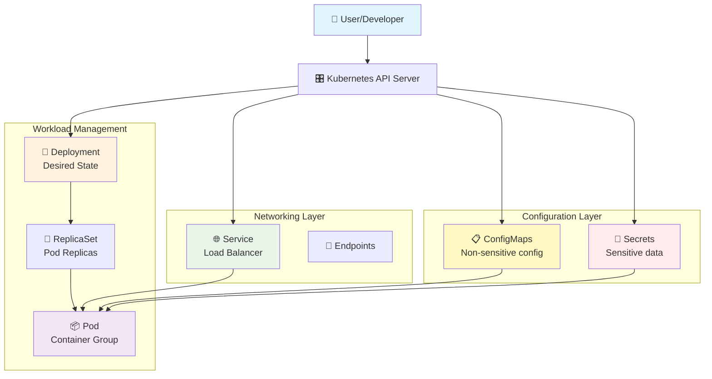

---

## 🏗️ **Component Relationships & Hierarchy**

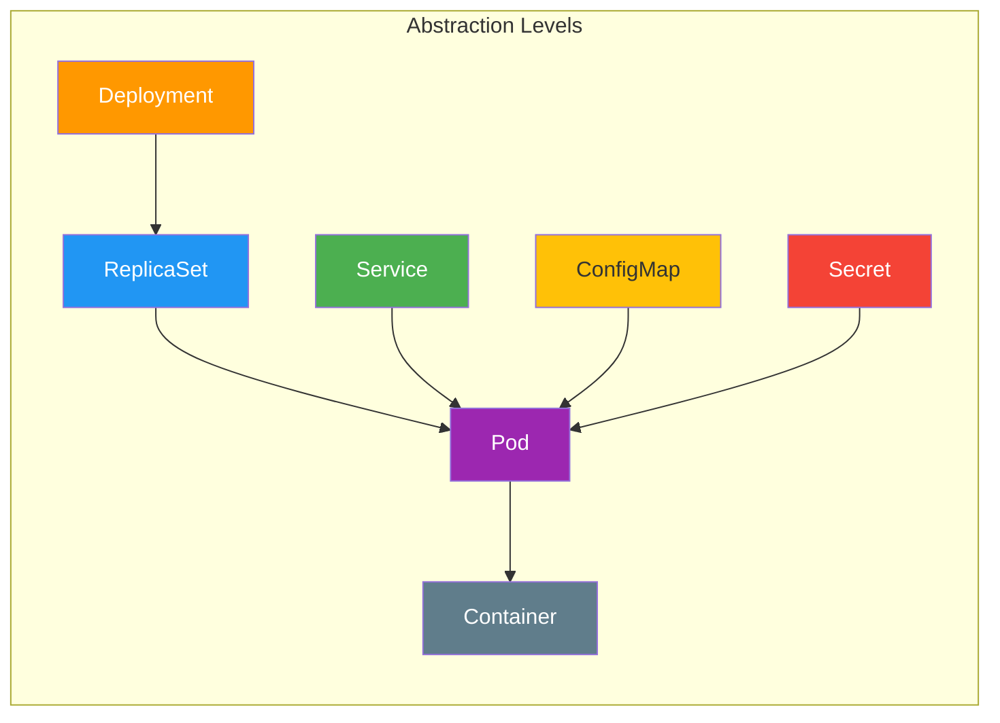

---

## 1. 📦 **Pods: The Foundation Unit**

### What Are Pods?

A Pod (as in a pod of whales or pea pod) is a group of one or more containers, with shared storage and network resources, and a specification for how to run the containers. Pods represent the atomic unit of deployment in Kubernetes.

### Key Characteristics

| Feature | Description | Why It Matters |
|---------|-------------|----------------|
| **Shared Network** | All containers in a pod share the same IP address and port space | Enables localhost communication between containers |
| **Shared Storage** | Containers can share volumes within the pod | Allows data sharing and persistence |
| **Lifecycle** | Kubernetes Pods are mortal. Pods have a lifecycle | Pods are ephemeral - designed to be replaced, not repaired |
| **Co-location** | A Pod's contents are always co-located and co-scheduled, and run in a shared context | Ensures related containers run on the same node |

### Pod Architecture

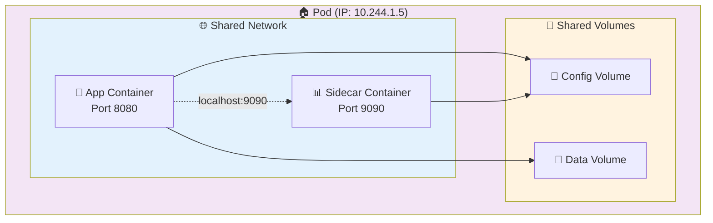

### Basic Pod YAML Example

```yaml
apiVersion: v1
kind: Pod
metadata:
  name: my-app-pod
  labels:
    app: my-app
    version: v1.0
spec:
  containers:
  - name: app-container
    image: nginx:1.21
    ports:
    - containerPort: 80
    env:
    - name: ENV
      value: "production"
    volumeMounts:
    - name: config-volume
      mountPath: /etc/config
  volumes:
  - name: config-volume
    configMap:
      name: app-config
```

### When to Use Pods Directly
- **Development/Testing**: Quick prototyping and debugging
- **Static Workloads**: Jobs that run once and don't need scaling
- **Advanced Use Cases**: Custom controllers or operators

⚠️ **Best Practice**: Usually you don't need to create Pods directly, even singleton Pods. Instead, create them using workload resources such as Deployment or Job

---

## 2. 🔄 **ReplicaSets: Ensuring High Availability**

### What Are ReplicaSets?

A ReplicaSet's purpose is to maintain a stable set of replica Pods running at any given time. ReplicaSets act as a controller that ensures your desired number of pod replicas are always running.

### ReplicaSet Workflow

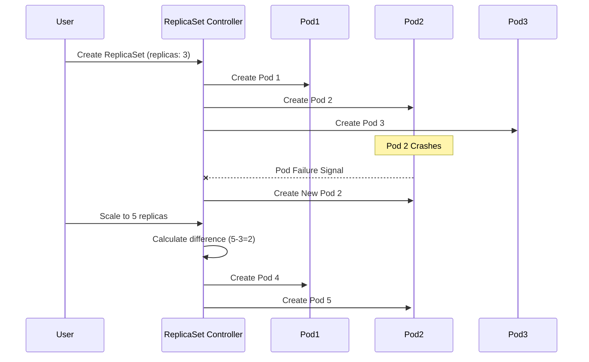

### ReplicaSet Architecture

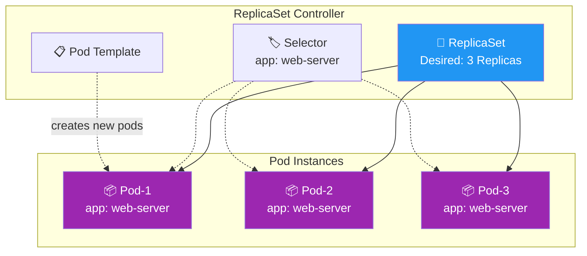

### ReplicaSet YAML Example

```yaml
apiVersion: apps/v1
kind: ReplicaSet
metadata:
  name: web-server-rs
  labels:
    app: web-server
spec:
  replicas: 3
  selector:
    matchLabels:
      app: web-server
  template:
    metadata:
      labels:
        app: web-server
    spec:
      containers:
      - name: web
        image: nginx:1.21
        ports:
        - containerPort: 80
```

### Key ReplicaSet Operations

| Operation | Command | Purpose |
|-----------|---------|---------|
| **Create** | `kubectl apply -f replicaset.yaml` | Deploy the ReplicaSet |
| **Scale Up** | `kubectl scale rs web-server-rs --replicas=5` | Increase pod count |
| **Scale Down** | `kubectl scale rs web-server-rs --replicas=1` | Decrease pod count |
| **Status** | `kubectl get rs` | View current replica status |
| **Describe** | `kubectl describe rs web-server-rs` | Detailed information |
| **Delete** | `kubectl delete rs web-server-rs` | Remove ReplicaSet and all pods |

⚠️ **Important**: Usually, you define a Deployment and let that Deployment manage ReplicaSets automatically

---

## 3. 🚀 **Deployments: Advanced Workload Management**

### What Are Deployments?

A Deployment manages a set of Pods to run an application workload, usually one that doesn't maintain state. A Deployment provides declarative updates for Pods and ReplicaSets. Deployments are the recommended way to manage application workloads in production.

### Deployment Features & Benefits

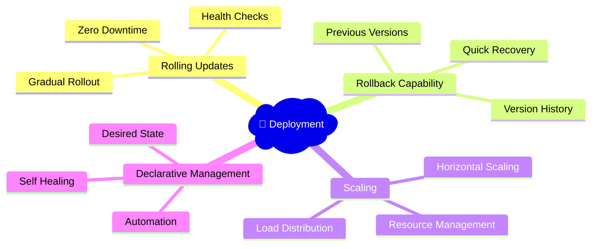

### Deployment vs ReplicaSet vs Pod

| Aspect | Pod | ReplicaSet | Deployment |
|--------|-----|------------|------------|
| **Purpose** | Run containers | Maintain replica count | Manage updates & rollouts |
| **Lifecycle** | Manual | Manual | Automated |
| **Updates** | Replace manually | Replace manually | Rolling updates |
| **Rollback** | Not supported | Not supported | ✅ Automatic |
| **Production Use** | ❌ Rare | ❌ Direct use discouraged | ✅ Recommended |

### Deployment Rollout Strategy

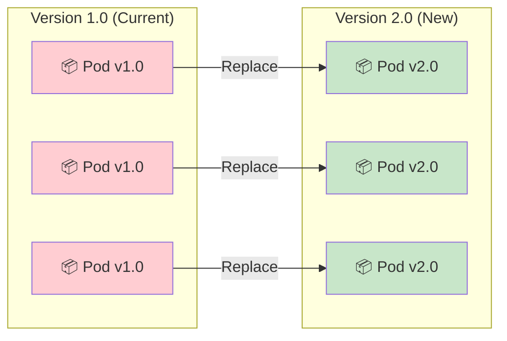

### Deployment YAML Example

```yaml
apiVersion: apps/v1
kind: Deployment
metadata:
  name: web-app-deployment
  labels:
    app: web-app
spec:
  replicas: 3
  strategy:
    type: RollingUpdate
    rollingUpdate:
      maxSurge: 1
      maxUnavailable: 1
  selector:
    matchLabels:
      app: web-app
  template:
    metadata:
      labels:
        app: web-app
    spec:
      containers:
      - name: web
        image: nginx:1.21
        ports:
        - containerPort: 80
        livenessProbe:
          httpGet:
            path: /health
            port: 80
          initialDelaySeconds: 30
          periodSeconds: 10
        readinessProbe:
          httpGet:
            path: /ready
            port: 80
          initialDelaySeconds: 5
          periodSeconds: 5
```

### Common Deployment Operations

| Task | Command | Example |
|------|---------|---------|
| **Deploy** | `kubectl apply -f deployment.yaml` | Create/Update deployment |
| **Scale** | `kubectl scale deployment web-app --replicas=5` | Horizontal scaling |
| **Update Image** | `kubectl set image deployment/web-app web=nginx:1.22` | Rolling update |
| **Rollback** | `kubectl rollout undo deployment/web-app` | Revert to previous version |
| **Status** | `kubectl rollout status deployment/web-app` | Check rollout progress |
| **History** | `kubectl rollout history deployment/web-app` | View rollout history |

---

## 4. 🌐 **Services: Network Abstraction & Load Balancing**

### What Are Services?

The Service API, part of Kubernetes, is an abstraction to help you expose groups of Pods over a network. Each Service object defines a logical set of endpoints (usually these endpoints are Pods) along with a policy about how to make those pods accessible.

### Why Services Are Essential

Each Pod gets its own IP address (Kubernetes expects network plugins to ensure this), but if some set of Pods (call them "backends") provides functionality to other Pods (call them "frontends") inside your cluster, how do the frontends find out and keep track of which IP address to connect to? This is where Services solve the problem.

### Service Types

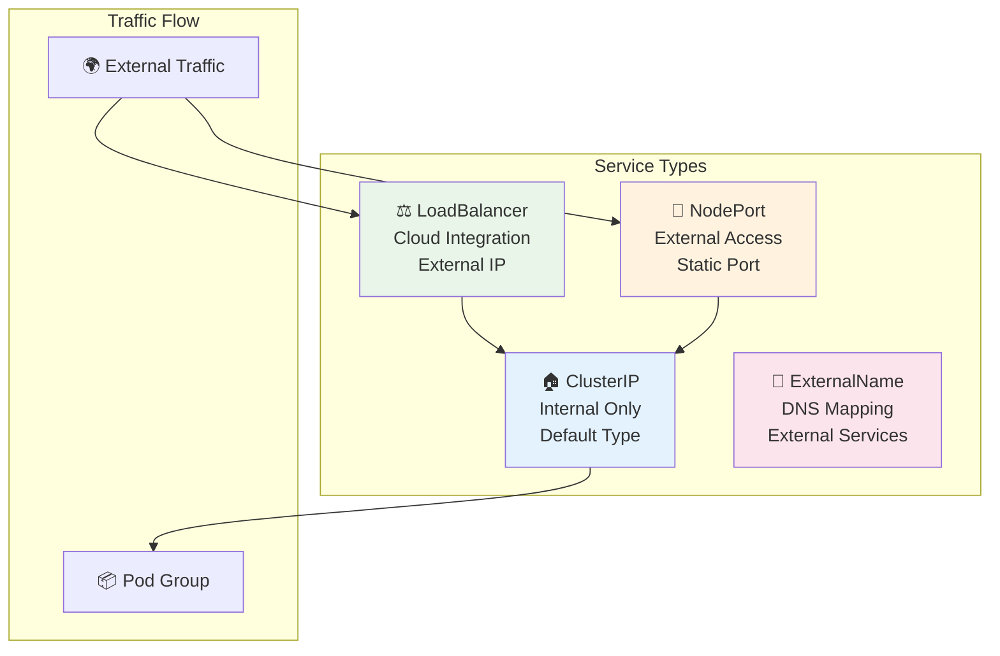

### Service Discovery Workflow

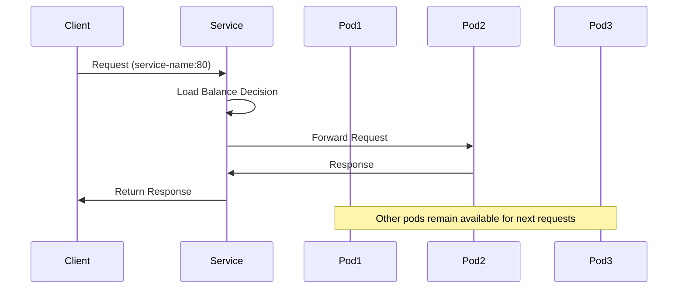

### Service YAML Examples

#### ClusterIP Service (Internal)
```yaml
apiVersion: v1
kind: Service
metadata:
  name: web-app-service
spec:
  type: ClusterIP
  selector:
    app: web-app
  ports:
  - port: 80
    targetPort: 8080
    protocol: TCP
```

#### LoadBalancer Service (External)
```yaml
apiVersion: v1
kind: Service
metadata:
  name: web-app-lb
spec:
  type: LoadBalancer
  selector:
    app: web-app
  ports:
  - port: 80
    targetPort: 8080
  loadBalancerSourceRanges:
  - 10.0.0.0/8
```

### Service Endpoints

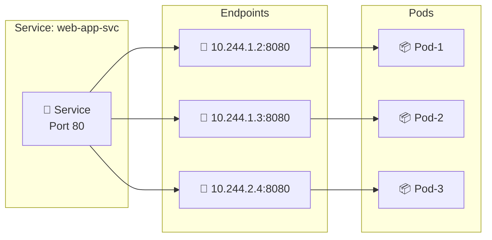

---

## 5. 📋 **ConfigMaps: Configuration Management**

### What Are ConfigMaps?

A ConfigMap allows you to decouple environment-specific configuration from your container images, so that your applications are easily portable. ConfigMaps decouple configuration from application code, making container images more portable and reusable.

### ConfigMap Data Types

| Data Type | Use Case | Example |
|-----------|----------|---------|
| **Environment Variables** | Application settings | `APP_MODE=production` |
| **Configuration Files** | App config files | `nginx.conf`, `prometheus.yml` |
| **Command Line Arguments** | Runtime parameters | `--verbose --timeout=30` |
| **Feature Flags** | Enable/disable features | `FEATURE_NEW_UI=true` |

### ConfigMap Creation Methods

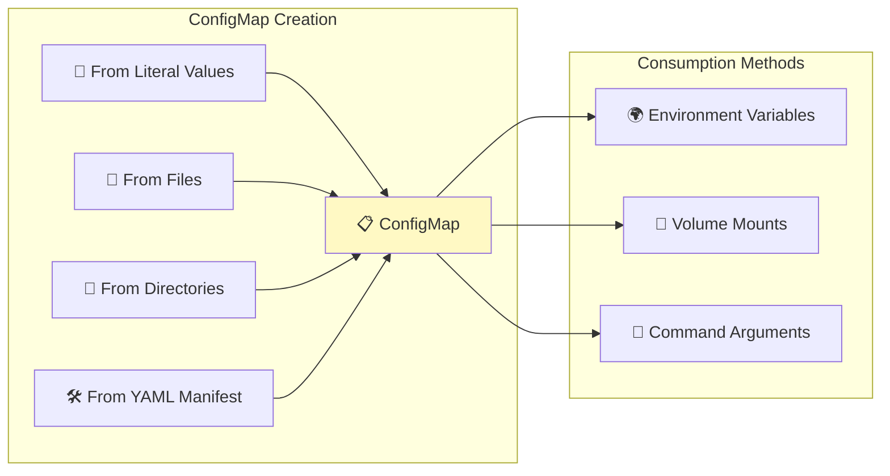

### ConfigMap Examples

#### Creating ConfigMaps

```bash
# From literal values
kubectl create configmap app-config \
  --from-literal=APP_MODE=production \
  --from-literal=LOG_LEVEL=info \
  --from-literal=DATABASE_URL=postgres://db:5432/myapp

# From file
kubectl create configmap nginx-config --from-file=nginx.conf

# From directory
kubectl create configmap app-configs --from-file=./config-dir/
```

#### ConfigMap YAML Manifest

```yaml
apiVersion: v1
kind: ConfigMap
metadata:
  name: app-config
  namespace: production
data:
  # Simple key-value pairs
  APP_MODE: "production"
  LOG_LEVEL: "info"
  DEBUG: "false"
  
  # Multi-line configuration file
  nginx.conf: |
    server {
        listen 80;
        server_name example.com;
        location / {
            proxy_pass http://backend:8080;
        }
    }
  
  # JSON configuration
  app-settings.json: |
    {
      "database": {
        "host": "db-server",
        "port": 5432,
        "name": "myapp"
      },
      "cache": {
        "enabled": true,
        "ttl": 3600
      }
    }
```

### Using ConfigMaps in Pods

#### As Environment Variables
```yaml
spec:
  containers:
  - name: app
    image: myapp:latest
    env:
    - name: APP_MODE
      valueFrom:
        configMapKeyRef:
          name: app-config
          key: APP_MODE
    - name: LOG_LEVEL
      valueFrom:
        configMapKeyRef:
          name: app-config
          key: LOG_LEVEL
```

#### As Volume Mounts
```yaml
spec:
  containers:
  - name: app
    image: myapp:latest
    volumeMounts:
    - name: config-volume
      mountPath: /etc/config
  volumes:
  - name: config-volume
    configMap:
      name: app-config
```

### ConfigMap Best Practices

✅ **DO:**
- Keep non-sensitive data in ConfigMaps and only use Secrets for sensitive information
- Use descriptive names for ConfigMap keys
- Version your ConfigMaps for different environments
- Validate configuration before applying

❌ **DON'T:**
- ConfigMap does not provide secrecy or encryption. If the data you want to store are confidential, use a Secret rather than a ConfigMap
- Store large files (>1MB) in ConfigMaps
- Put passwords or tokens in ConfigMaps

---

## 6. 🔐 **Secrets: Secure Data Management**

### What Are Secrets?

A Kubernetes Secret is an object that stores and manages sensitive information like passwords, API keys, tokens, or any other secret data. Secrets are almost the same as ConfigMaps. There is one small difference. ConfigMaps are used to store application configurations like API URLs, non-confidential data, feature activations flags. But Secrets are used for storing sensitive data like passwords, API secrets.

### Secret vs ConfigMap Comparison

| Aspect | ConfigMap | Secret |
|--------|-----------|--------|
| **Data Type** | Non-sensitive configuration | Sensitive information |
| **Encoding** | Plain text | Secrets in Kubernetes are base64-encoded |
| **Security** | No special protection | RBAC controls, audit logging |
| **Size Limit** | 1 MiB | 1 MiB |
| **Use Cases** | App settings, feature flags | Passwords, API keys, certificates |

### Secret Types

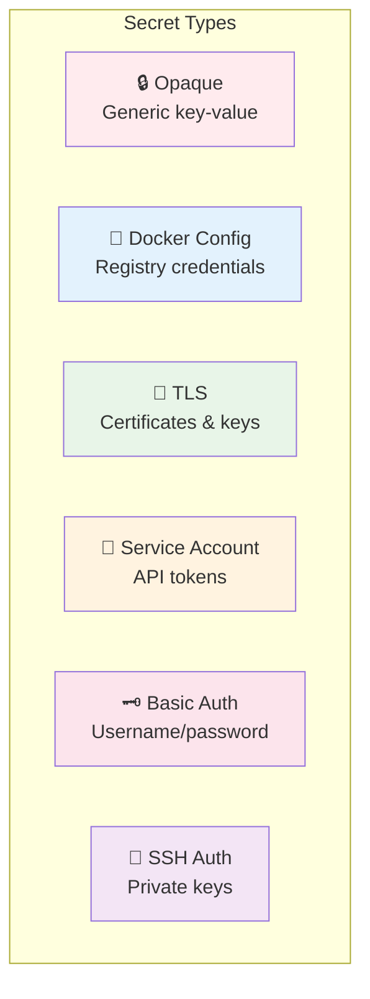

### Secret Security Architecture

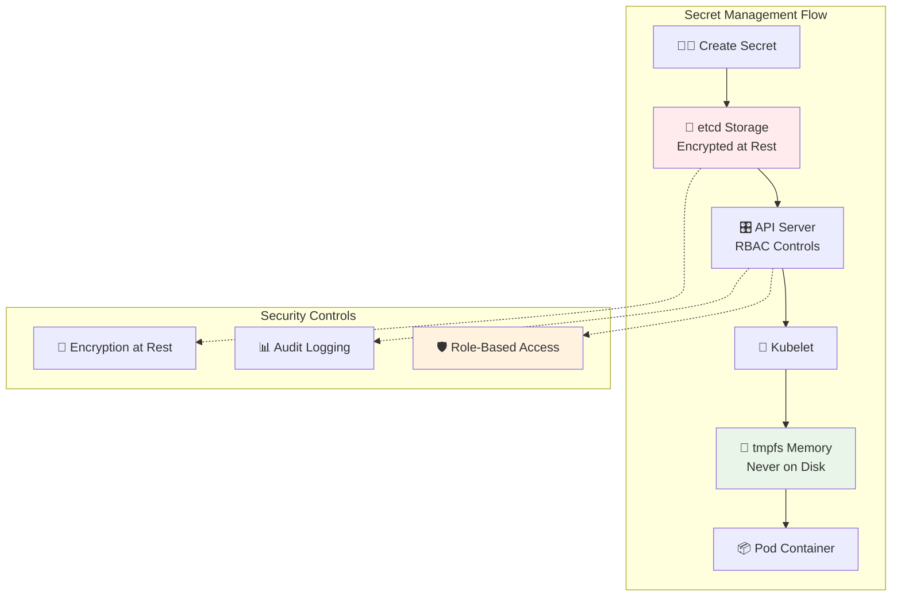

### Secret YAML Examples

#### Opaque Secret (Generic)
```yaml
apiVersion: v1
kind: Secret
metadata:
  name: app-secrets
type: Opaque
data:
  # Base64 encoded values
  username: YWRtaW4=  # 'admin'
  password: MWYyZDFlMmU2N2Rm  # '1f2d1e2e67df'
  api-key: bXlfc3VwZXJfc2VjcmV0X2FwaV9rZXk=  # 'my_super_secret_api_key'
stringData:
  # Plain text values (automatically base64 encoded)
  database-url: "postgres://user:pass@db:5432/myapp"
  jwt-secret: "my-jwt-signing-secret"
```

#### TLS Secret
```yaml
apiVersion: v1
kind: Secret
metadata:
  name: tls-secret
type: kubernetes.io/tls
data:
  tls.crt: LS0tLS1CRUdJTi... # Base64 encoded certificate
  tls.key: LS0tLS1CRUdJTi... # Base64 encoded private key
```

#### Docker Registry Secret
```yaml
apiVersion: v1
kind: Secret
metadata:
  name: docker-registry-secret
type: kubernetes.io/dockerconfigjson
data:
  .dockerconfigjson: eyJhdXRocyI6eyJyZWdpc3RyeS... # Base64 encoded Docker config
```

### Using Secrets in Pods

#### As Environment Variables
```yaml
spec:
  containers:
  - name: app
    image: myapp:latest
    env:
    - name: DATABASE_PASSWORD
      valueFrom:
        secretKeyRef:
          name: app-secrets
          key: password
    - name: API_KEY
      valueFrom:
        secretKeyRef:
          name: app-secrets
          key: api-key
```

#### As Volume Mounts
```yaml
spec:
  containers:
  - name: app
    image: myapp:latest
    volumeMounts:
    - name: secret-volume
      mountPath: /etc/secrets
      readOnly: true
  volumes:
  - name: secret-volume
    secret:
      secretName: app-secrets
      defaultMode: 0400  # Read-only for owner only
```

### Secret Management Best Practices

✅ **Security Best Practices:**
- Use Kubernetes RBAC policies to control access
- Consider encrypting Secrets at rest
- The best security practice is the one that's automated and enforced by default
- Rotate secrets regularly
- Use external secret management tools for production

✅ **Operational Best Practices:**
- Avoid storing sensitive data in version-controlled files
- Use different secrets for different environments
- Monitor secret access and changes
- Implement automated secret rotation

---

## 7. 🔗 **Component Integration Patterns**

### Complete Application Stack

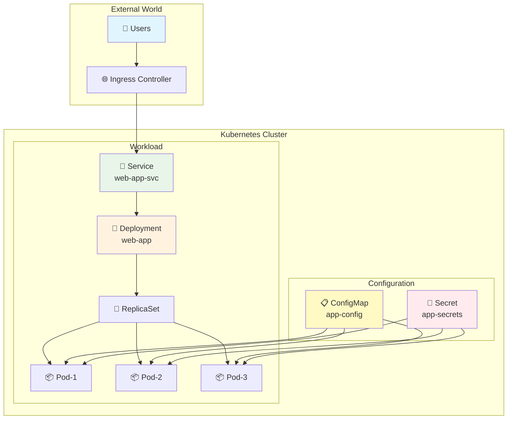

### Real-World Example: Web Application with Database

```yaml
# ConfigMap for application settings
apiVersion: v1
kind: ConfigMap
metadata:
  name: webapp-config
data:
  APP_ENV: "production"
  LOG_LEVEL: "info"
  REDIS_HOST: "redis-service"
  REDIS_PORT: "6379"

---
# Secret for sensitive data
apiVersion: v1
kind: Secret
metadata:
  name: webapp-secrets
type: Opaque
stringData:
  database-password: "super-secret-password"
  jwt-secret: "my-jwt-signing-key"
  api-key: "external-api-key-12345"

---
# Deployment with ConfigMap and Secret
apiVersion: apps/v1
kind: Deployment
metadata:
  name: webapp-deployment
spec:
  replicas: 3
  selector:
    matchLabels:
      app: webapp
  template:
    metadata:
      labels:
        app: webapp
    spec:
      containers:
      - name: webapp
        image: mycompany/webapp:v2.1
        ports:
        - containerPort: 8080
        
        # Environment variables from ConfigMap
        envFrom:
        - configMapRef:
            name: webapp-config
        
        # Sensitive environment variables from Secret
        env:
        - name: DB_PASSWORD
          valueFrom:
            secretKeyRef:
              name: webapp-secrets
              key: database-password
        - name: JWT_SECRET
          valueFrom:
            secretKeyRef:
              name: webapp-secrets
              key: jwt-secret
        
        # Volume mounts for additional config files
        volumeMounts:
        - name: config-volume
          mountPath: /app/config
        - name: secret-volume
          mountPath: /app/secrets
          readOnly: true
          
      volumes:
      - name: config-volume
        configMap:
          name: webapp-config
      - name: secret-volume
        secret:
          secretName: webapp-secrets

---
# Service to expose the application
apiVersion: v1
kind: Service
metadata:
  name: webapp-service
spec:
  selector:
    app: webapp
  ports:
  - port: 80
    targetPort: 8080
  type: LoadBalancer
```

---

## 8. 📋 **Quick Reference Tables**

### Component Command Cheatsheet

| Component | Create | Get | Describe | Update | Delete |
|-----------|--------|-----|----------|--------|--------|
| **Pod** | `kubectl run pod-name --image=nginx` | `kubectl get pods` | `kubectl describe pod pod-name` | `kubectl apply -f pod.yaml` | `kubectl delete pod pod-name` |
| **ReplicaSet** | `kubectl apply -f rs.yaml` | `kubectl get rs` | `kubectl describe rs rs-name` | `kubectl scale rs rs-name --replicas=5` | `kubectl delete rs rs-name` |
| **Deployment** | `kubectl create deployment app --image=nginx` | `kubectl get deployments` | `kubectl describe deployment app` | `kubectl set image deployment/app nginx=nginx:1.22` | `kubectl delete deployment app` |
| **Service** | `kubectl expose deployment app --port=80` | `kubectl get svc` | `kubectl describe svc app` | `kubectl apply -f service.yaml` | `kubectl delete svc app` |
| **ConfigMap** | `kubectl create configmap config --from-literal=key=value` | `kubectl get cm` | `kubectl describe cm config` | `kubectl apply -f cm.yaml` | `kubectl delete cm config` |
| **Secret** | `kubectl create secret generic secret --from-literal=key=value` | `kubectl get secrets` | `kubectl describe secret secret` | `kubectl apply -f secret.yaml` | `kubectl delete secret secret` |

### Troubleshooting Common Issues

| Problem | Symptoms | Common Causes | Solution |
|---------|----------|---------------|----------|
| **Pod Pending** | Pod stuck in Pending state | Resource constraints, node selector issues | Check resource requests, node capacity |
| **Image Pull Error** | Pod fails to start | Wrong image name, registry auth | Verify image exists, check imagePullSecrets |
| **ConfigMap Not Found** | Pod creation fails | ConfigMap doesn't exist, wrong name | Create ConfigMap first, verify name spelling |
| **Secret Mount Failed** | Pod fails to mount secret | RBAC issues, secret doesn't exist | Check permissions, verify secret exists |
| **Service Not Accessible** | Cannot reach application | Wrong selector, pod labels mismatch | Check service selector matches pod labels |
| **Deployment Stuck** | Rollout doesn't progress | Health check failures, resource limits | Check readiness/liveness probes, resources |

---

## 9. 🏭 **Production Deployment Patterns**

### Multi-Environment Strategy

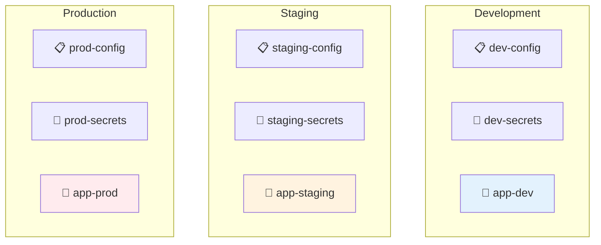

### Namespace-Based Environment Separation

```yaml
# Development Namespace
apiVersion: v1
kind: Namespace
metadata:
  name: development
  labels:
    environment: dev

---
# Production Namespace
apiVersion: v1
kind: Namespace
metadata:
  name: production
  labels:
    environment: prod
```

### Advanced Deployment Strategies

#### Blue-Green Deployment
```yaml
apiVersion: apps/v1
kind: Deployment
metadata:
  name: webapp-blue
spec:
  replicas: 3
  selector:
    matchLabels:
      app: webapp
      version: blue
  template:
    metadata:
      labels:
        app: webapp
        version: blue
    spec:
      containers:
      - name: webapp
        image: myapp:v1.0

---
apiVersion: apps/v1
kind: Deployment
metadata:
  name: webapp-green
spec:
  replicas: 3
  selector:
    matchLabels:
      app: webapp
      version: green
  template:
    metadata:
      labels:
        app: webapp
        version: green
    spec:
      containers:
      - name: webapp
        image: myapp:v2.0
```

#### Canary Deployment
```yaml
apiVersion: apps/v1
kind: Deployment
metadata:
  name: webapp-stable
spec:
  replicas: 9  # 90% of traffic
  selector:
    matchLabels:
      app: webapp
      track: stable

---
apiVersion: apps/v1
kind: Deployment
metadata:
  name: webapp-canary
spec:
  replicas: 1  # 10% of traffic
  selector:
    matchLabels:
      app: webapp
      track: canary
```

---

## 10. 🔧 **Practical Exercises & Labs**

### Lab 1: Deploy a Complete Application Stack

**Objective**: Deploy a web application with database, using all learned components.

**Step-by-Step Guide:**

1. **Create the Namespace**
```bash
kubectl create namespace webapp-lab
kubectl config set-context --current --namespace=webapp-lab
```

2. **Deploy Database with Secrets**
```yaml
# database-secret.yaml
apiVersion: v1
kind: Secret
metadata:
  name: db-secret
type: Opaque
stringData:
  postgres-password: "mySecurePassword123"
  postgres-user: "appuser"
  postgres-db: "myapp"
```

3. **Create Application ConfigMap**
```yaml
# app-configmap.yaml
apiVersion: v1
kind: ConfigMap
metadata:
  name: app-config
data:
  APP_MODE: "production"
  LOG_LEVEL: "info"
  DB_HOST: "postgres-service"
  DB_PORT: "5432"
```

4. **Deploy Database**
```yaml
# postgres-deployment.yaml
apiVersion: apps/v1
kind: Deployment
metadata:
  name: postgres
spec:
  replicas: 1
  selector:
    matchLabels:
      app: postgres
  template:
    metadata:
      labels:
        app: postgres
    spec:
      containers:
      - name: postgres
        image: postgres:13
        env:
        - name: POSTGRES_PASSWORD
          valueFrom:
            secretKeyRef:
              name: db-secret
              key: postgres-password
        - name: POSTGRES_USER
          valueFrom:
            secretKeyRef:
              name: db-secret
              key: postgres-user
        - name: POSTGRES_DB
          valueFrom:
            secretKeyRef:
              name: db-secret
              key: postgres-db
        ports:
        - containerPort: 5432
```

5. **Create Database Service**
```yaml
# postgres-service.yaml
apiVersion: v1
kind: Service
metadata:
  name: postgres-service
spec:
  selector:
    app: postgres
  ports:
  - port: 5432
    targetPort: 5432
```

### Lab 2: ConfigMap and Secret Updates

**Scenario**: Update application configuration without downtime.

```bash
# Update ConfigMap
kubectl patch configmap app-config -p '{"data":{"LOG_LEVEL":"debug"}}'

# Update Secret
kubectl patch secret app-secret -p '{"stringData":{"api-key":"new-api-key-value"}}'

# Restart deployment to pick up changes
kubectl rollout restart deployment webapp-deployment
```

### Lab 3: Scaling and Load Testing

```bash
# Scale up for high load
kubectl scale deployment webapp --replicas=10

# Monitor the scaling
kubectl get pods -w

# Load test (if you have access to a load testing tool)
# This would generate traffic to test your service

# Scale down after testing
kubectl scale deployment webapp --replicas=3
```

---

## 11. 🚨 **Troubleshooting Guide**

### Diagnostic Commands

```bash
# Check cluster status
kubectl cluster-info
kubectl get nodes

# Check pod status and logs
kubectl get pods -o wide
kubectl describe pod <pod-name>
kubectl logs <pod-name> -f

# Check deployment status
kubectl get deployments
kubectl describe deployment <deployment-name>
kubectl rollout status deployment/<deployment-name>

# Check service endpoints
kubectl get svc
kubectl describe svc <service-name>
kubectl get endpoints

# Check configuration
kubectl get configmaps
kubectl describe configmap <configmap-name>
kubectl get secrets
kubectl describe secret <secret-name>
```

### Common Issues and Solutions

#### 1. Pod Stuck in Pending
```bash
# Check events
kubectl describe pod <pod-name>

# Common fixes:
# - Insufficient resources: Add resource requests
# - Node selector issues: Check node labels
# - PVC issues: Verify storage classes
```

#### 2. Service Not Reachable
```bash
# Check service and endpoints
kubectl get svc,endpoints

# Verify pod labels match service selector
kubectl get pods --show-labels
kubectl describe svc <service-name>
```

#### 3. ConfigMap/Secret Not Loading
```bash
# Check if resources exist
kubectl get cm,secrets

# Verify pod configuration
kubectl describe pod <pod-name>

# Check RBAC permissions
kubectl auth can-i get secrets --as=system:serviceaccount:default:default
```

---

## 12. 🎯 **Best Practices Summary**

### Configuration Management
- **Separation of Concerns**: Keep non-sensitive data in ConfigMaps and only use Secrets for sensitive information
- **Environment Isolation**: Use different ConfigMaps and Secrets per environment
- **Version Control**: Never commit secrets to version control
- **Automation**: Implement GitOps for configuration management

### Security
- **Principle of Least Privilege**: Use RBAC to limit access
- **Encryption**: Enable encryption at rest for etcd
- **Secret Rotation**: Implement automated secret rotation
- **Audit Logging**: Monitor access to sensitive resources

### Scalability
- **Resource Planning**: Set appropriate resource requests and limits
- **Horizontal Scaling**: Use Deployments for stateless applications
- **Health Checks**: Implement proper liveness and readiness probes
- **Rolling Updates**: Use deployment strategies to minimize downtime

### Monitoring & Observability
- **Logging**: Centralized logging for all components
- **Metrics**: Monitor pod, deployment, and service metrics
- **Alerting**: Set up alerts for failures and resource usage
- **Tracing**: Implement distributed tracing for microservices

---

## 13. 📚 **Additional Resources & Next Steps**

### Further Learning
1. **Kubernetes Networking**: Services, Ingress, Network Policies
2. **Storage**: Persistent Volumes, Storage Classes
3. **Security**: RBAC, Pod Security Standards, Network Policies
4. **Monitoring**: Prometheus, Grafana, Logging solutions
5. **GitOps**: ArgoCD, Flux for automated deployments

### Useful Tools
- **kubectl**: Primary CLI tool for Kubernetes
- **k9s**: Terminal-based UI for Kubernetes
- **Helm**: Package manager for Kubernetes
- **kustomize**: Template-free configuration customization
- **kubectx/kubens**: Switch between contexts and namespaces

### Practice Environments
- **Minikube**: Local Kubernetes cluster
- **kind**: Kubernetes in Docker
- **k3s**: Lightweight Kubernetes distribution
- **Cloud Platforms**: EKS, GKE, AKS for production learning

---

## 💡 **Key Takeaways**

1. **Start Simple**: Begin with Pods to understand the basics, then move to higher-level abstractions
2. **Use Deployments**: Usually, you define a Deployment and let that Deployment manage ReplicaSets automatically
3. **Secure by Default**: Always use Secrets for sensitive data, never ConfigMaps
4. **Plan for Scale**: Design your applications with horizontal scaling in mind
5. **Monitor Everything**: Implement proper observability from day one
6. **Practice Regularly**: Hands-on experience is crucial for mastering Kubernetes

---

*This guide provides a comprehensive foundation for understanding Kubernetes components. Continue practicing with real workloads and gradually introduce more advanced concepts as your team's expertise grows.*